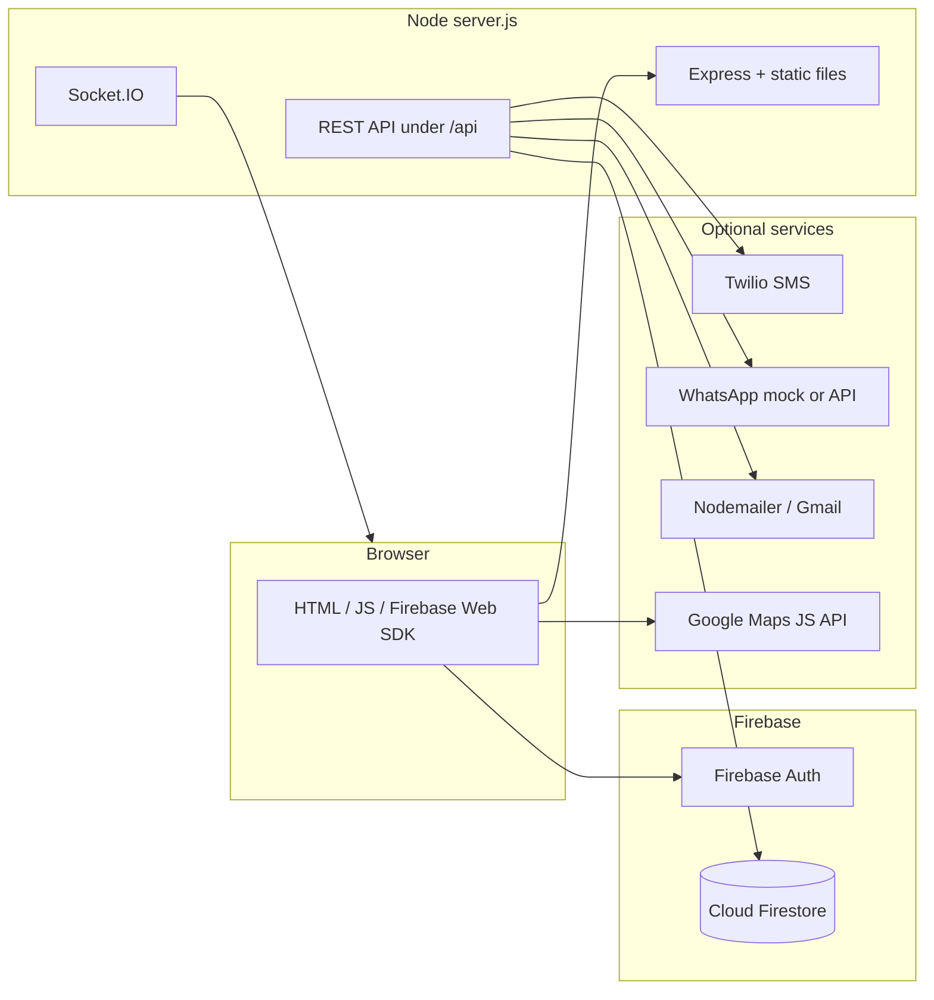

# Her Shield — Women’s Safety Platform

Her Shield is a full-stack safety web app: **Firebase Authentication** on the client, **Express + Firebase Admin (Cloud Firestore)** on the server, optional **SMS (Twilio)** / **WhatsApp**, **email (Nodemailer)** for live-tracker alerts, **Google Maps** on key pages, and **Socket.IO** for real-time tracking-room events. Static HTML/CSS/JS pages are served from the repo root by the same Node process that hosts the API, so the browser always talks to the API on the **same origin** (important when the HTTP port changes).

**For another developer or agent:** read this file, then `.env.example`, then `server.js` (route mounts + static) and `services/firestoreRepository.js` (all Firestore collections and writes). The UI entry points are `index.html`, `auth.html`, `dashboard.html`, `live-tracker.html`, `community.html`, `safety-map.html`, and mirrored copies under `public/` where noted.

---

## How the project runs (architecture)



1. **`npm start`** runs **`server.js`** from the project root.
2. **`dotenv`** loads **`.env`** from the directory that contains `server.js` (not necessarily your shell’s current working directory).
3. **Express** serves the whole repo as static files (`express.static('.')`), so `http://localhost:<port>/dashboard.html` is the real dashboard.
4. **API routes** are mounted under `/api/*` (see table below).
5. **Persistence** for users, tracking sessions, incidents, community posts, live-tracker sessions, and safety locations is **Firestore** via **`firebase-admin`** in `services/firestoreRepository.js`. Without a valid service account, **GET** endpoints may return empty/degraded data; **POST** endpoints that write will fail with a clear error until you configure Firebase Admin.
6. **Port:** `PORT` defaults to `3000`. If that port is busy, **`config/listenWithFallback.js`** tries the next ports up to `PORT + PORT_RANGE` (default range 25). **`APP_URL`** is set automatically to `http://localhost:<actualPort>` when not provided, so share links match the running port.
7. **Alternate entry:** `node public/server.js` uses **`public/server.js`**, which loads `.env` from the **parent** folder and reuses the same `routes/` and `config/` — useful if you start the process from `public/`.

---

## Features (product)

| Area | What it does |
|------|----------------|
| **Auth** | Sign-in via Firebase (`auth.html`, `firebase-auth.js`); profile data can be synced with backend user records. |
| **Dashboard** | Safety map snippets, alerts, incident reporting, SOS-style dashboard email flow (`dashboard.html`). |
| **Live tracker** | PIN-based session, periodic checks, location updates, emergency email to contacts (`live-tracker.html`, `live-tracker.js`, `/api/live-tracker/*`). |
| **Classic tracking** | Shareable tracking code, location history, emergency hooks tied to Firestore users (`/api/tracking/*`, `emergencyLite` / `trackingLite`). |
| **Emergency** | SOS to contacts via SMS/WhatsApp when Twilio/WhatsApp are configured; uses stored emergency contacts on the user document (`/api/emergency/*`). |
| **Safety intelligence** | Heatmap and route risk scoring from incident data (`/api/safety/heatmap`, `/api/safety/route`, `services/safetyAnalytics.js`). |
| **Incidents** | Report and list incidents (`/api/safety/report`, `/api/safety/incidents`, …). |
| **Safety locations** | Optional seeded points from CSV + CRUD-style API (`routes/safetyLocations.js`). |
| **Community** | Posts and alerts stored in Firestore (`community.html`, `/api/community/posts`, `/api/community/alerts`). |
| **Real-time rooms** | Socket.IO events for join session, location broadcast, emergency, check-in, end session (`server.js`). |

---

## Tech stack (implementation)

| Layer | Technologies |
|--------|----------------|
| **Frontend** | HTML5, CSS, JavaScript (vanilla), Bootstrap 5, Font Awesome, GSAP (community), Google Maps JavaScript API |
| **Backend** | Node.js 18+, Express 4, `express-validator`, `helmet`, `cors`, `compression`, `morgan`, `express-rate-limit` |
| **Database** | **Cloud Firestore** (Firebase Admin SDK) — primary store for app data |
| **Auth (client)** | Firebase Auth (Web SDK in `firebase-config.js` / `public/firebase-config.js`) |
| **Real-time** | Socket.IO |
| **Messaging** | Twilio (SMS), WhatsApp service (mock or configured), Nodemailer (Gmail-style for live tracker / dashboard SOS email) |
| **Dev / QA** | `npm run smoke` — `scripts/smoke-api.js` hits core REST endpoints (set `SMOKE_BASE` if not on port 3000) |

**Note:** Dependencies like **mongoose** / **connect-mongo** / **nedb** may remain in `package.json` from earlier iterations; **Her Shield API data paths used by `server.js` are Firestore-backed**, not MongoDB. See `config/database.js` for the current persistence message.

---

## Prerequisites

- **Node.js ≥ 18**
- **Firebase project** with **Firestore** enabled and a **Web app** for client config
- **Service account JSON** for **Firebase Admin** (server-side Firestore)
- **Google Maps API key** (used in HTML; restrict by HTTP referrer in production)
- **Optional:** Twilio (real SMS), WhatsApp credentials, Gmail app password for `EMAIL_USER` / `EMAIL_PASS`

---

## Installation and configuration

### 1. Install dependencies

```bash
cd hackathon
npm install
```

### 2. Environment variables

Copy `.env.example` to `.env` and fill in values. **Never commit `.env` or service account keys.**

**Minimum for writes (posts, incidents, users, tracking):**

- `FIREBASE_SERVICE_ACCOUNT_PATH=./your-service-account.json`  
  **or** `FIREBASE_SERVICE_ACCOUNT_JSON=<single-line JSON>` (common on Render)  
  **or** `GOOGLE_APPLICATION_CREDENTIALS` pointing at the same JSON file.

On Windows, a **file path** is usually easier than pasting JSON into `.env`.

### 3. Firebase client (browser)

Edit **`firebase-config.js`** (and **`public/firebase-config.js`** if you serve from `public/`) with the Firebase **Web** config from the console (same project as the service account).

### 4. Start the server

```bash
npm start
```

Watch the console for the **actual URL** (e.g. `http://localhost:3000` or `3002` if 3000 is in use). **Always open HTML pages from that same origin** so `/api/...` and static assets resolve correctly.

### 5. Optional API smoke test

With the server running:

```bash
# Windows PowerShell
$env:SMOKE_BASE="http://127.0.0.1:3000"
npm run smoke
```

Adjust `SMOKE_BASE` to match the printed port.

---

## Main HTTP API (mounted by `server.js`)

| Prefix | Module | Purpose |
|--------|--------|---------|
| `/api/emergency` | `routes/emergencyLite.js` | SOS trigger, contacts CRUD, share location |
| `/api/tracking` | `routes/trackingLite.js` | Tracking sessions by user/code, location updates, end session |
| `/api/safety` | `routes/safety.js` | Heatmap, route safety, incidents CRUD-style, report, stats, votes/comments |
| `/api/safety` | `routes/safetyLocations.js` | Safety location points (also shares `/api/safety` prefix) |
| `/api/users` | `routes/users.js` | Register, profile, stats, lookup by email |
| `/api/live-tracker` | `routes/liveTracker.js` | Alternate live flow: start, location, PIN verify, SOS email, dashboard alert |
| `/api/community` | `routes/community.js` | Community posts and alerts |
| `GET /api/health` | `server.js` | Liveness + Firestore configured flag |

**Firestore collections** (see `firestoreRepository.js` for exact names) include roughly: `hershield_users`, `hershield_tracking_sessions`, `hershield_incidents`, `hershield_community`, `hershield_live_tracker_sessions`, `hershield_safety_locations`.

---

## Primary pages (open from running server)

| Path | Role |
|------|------|
| `index.html` | Landing |
| `auth.html` | Firebase login / signup |
| `dashboard.html` | Main dashboard (map, report issue, SOS email, alerts) |
| `live-tracker.html` | Live tracker UI (`live-tracker.js`) |
| `community.html` | Community feed + create post |
| `safety-map.html` | Safety map / locations |
| `public/*` | Duplicate or sibling copies of some pages for alternate hosting; **`public/dashboard.html`** is kept in sync with root **`dashboard.html`** for feature parity |

---

## Project structure (high level)

```
hackathon/
├── server.js                 # Main entry: dotenv, Express, static, API, Socket.IO
├── public/
│   └── server.js             # Alternate entry; loads ../.env and same routes
├── config/
│   ├── firestoreAdmin.js     # Firebase Admin init (path or inline JSON)
│   ├── database.js           # Firestore health / persistence note
│   └── listenWithFallback.js # PORT + EADDRINUSE fallback, APP_URL default
├── routes/
│   ├── emergencyLite.js      # Wired in server.js
│   ├── trackingLite.js
│   ├── safety.js
│   ├── safetyLocations.js
│   ├── users.js
│   ├── community.js
│   ├── liveTracker.js
│   ├── emergency.js          # Legacy / fuller variant (not mounted by default)
│   └── tracking.js
├── services/
│   ├── firestoreRepository.js # All Firestore access
│   ├── safetyAnalytics.js
│   ├── smsService.js
│   └── whatsappService.js
├── scripts/
│   └── smoke-api.js          # npm run smoke
├── firebase.json             # Firebase hosting / rules references
├── firestore.rules
├── firestore.indexes.json
├── .env.example
├── dashboard.html            # Served as static file by server.js
├── community.html
├── live-tracker.html
└── ...
```

---

## Troubleshooting (quick)

| Symptom | What to check |
|---------|----------------|
| **“Firestore is not configured”** | `.env` next to `server.js`; `FIREBASE_SERVICE_ACCOUNT_PATH` or `FIREBASE_SERVICE_ACCOUNT_JSON`; restart Node after changes. |
| **API 404 or HTML instead of JSON** | Open the app from **`http://localhost:<port>/...`** served by this server, not `file://` or a different port. |
| **Wrong link in SMS / share URL** | Set **`APP_URL`** explicitly in production; locally the server sets it from the listening port if unset. |
| **Email SOS fails** | Set **`EMAIL_USER`** and **`EMAIL_PASS`** (Gmail app password if using Gmail). |
| **SMS mock mode** | Twilio env vars missing or invalid — see server logs. |
| **Port in use** | Stop other processes or set **`PORT`**; the server tries the next ports up to **`PORT_RANGE`** and prints the **one** URL it actually bound (see console). |
| **Two startup banners / wrong port in logs** | Fixed in current `listenWithFallback` (close-before-retry). Upgrade to latest `config/listenWithFallback.js` if you still see duplicates. |
| **PowerShell** | Use `;` between commands, not `&&` (older Windows PowerShell). Example: `cd hackathon; npm start`. |
| **Sanity check** | `npm run verify` runs `node --check server.js` before deploy. |

---

## Deployment notes

- **Render / similar:** set `FIREBASE_SERVICE_ACCOUNT_JSON`, `APP_URL`, `NODE_ENV=production`, **`TRUST_PROXY=1`** (so rate limiting and client IPs work behind the proxy), and optional Twilio/email vars. See `.env.example`.
- **Firebase Hosting:** can host static files; API must run on a backend that holds the **service account** (Hosting alone does not run `server.js`).
- Restrict **Google Maps** and **Firebase** keys by domain in their consoles.

---

## UI palette

Shared across HTML/CSS (see `styles.css` `:root` and per-page `--gradient-*` where used):

| Token | Hex | Use |
|-------|-----|-----|
| Surface / cream | `#F2EAE0` | Page background, soft panels |
| Teal | `#B4D3D9` | Accents, secondary fills, map-adjacent UI |
| Lilac | `#BDA6CE` | Gradients, highlights, primary–mid |
| Purple | `#9B8EC7` | Primary actions, emphasis, icons |

---

## License

This project is for educational and safety-related use.

---

**Her Shield — built for women’s safety**
